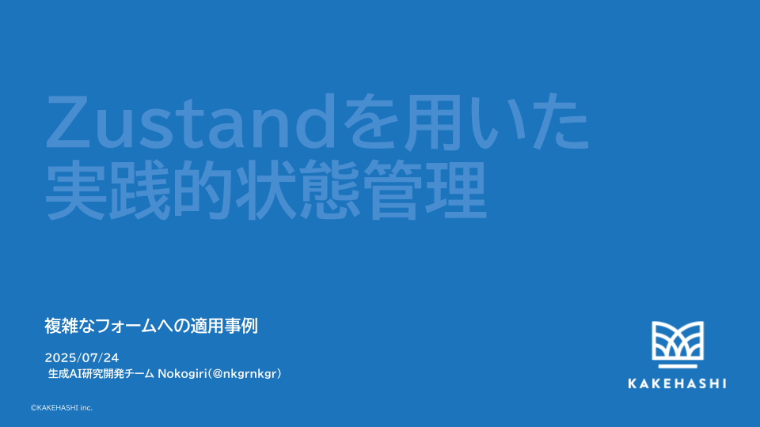

---


## 自己紹介

**株式会社カケハシ**
**生成AI研究開発チーム**
**ソフトウェアエンジニア**
**Nokogiri(@nkgrnkgr)**

---


## 株式会社カケハシ

- 医療体験をしなやかに
- 主に薬局向けの業務システムを提供
- ヘルステックスタートアップ

---

## 今日話すこと

1. useState以上の状態管理が必要なケース
2. Zustandを使った設計・実装プラクティス
3. 得られた知見

---

## useState以上の状態管理が必要なケース

- 状態間の依存
- 散在する状態更新ロジック
- 頻繁な再描画によるパフォーマンス問題

---


## 具体的な事例：AI在庫の入庫ダイアログ

- 動的に変わる初期値
- 更新時に他の状態を更新する

---


---

## Zustandによる解決

- 中央集権的な状態管理
- アクションによる状態更新の集約
- セレクターによる効率的な再描画制御

---

## Zustand 具体的なプラクティス

---

### 1. Actions に状態更新ロジックを集約する

```typescript
const useStoreStockDialogStore = create<StoreStockDialogStore>()((set) => ({
  actions: {
    updateStoreStockReason: (reason) => {
      set((state) => ({
        ...state,
        // プライマリ状態の更新
        storeStockInfoFormValues: {
          ...state.storeStockInfoFormValues,
          storeStockReason: reason,
          // 他の状態への副作用
          counterPartyId: INITIAL_FORM_VALUES.counterPartyId,
          counterPartyName: INITIAL_FORM_VALUES.counterPartyName,
        },
        stockOperationConfig: {
          ...state.stockOperationConfig,
          counterParty: null,
        },
      }));
    },
  },
}));
```

---

### 2. セレクターによる効率的な状態参照

```typescript
// selectors.ts
export const selectFeeAmount = (state: StoreStockDialogStore) =>
  state.storeStockInfoFormValues.feeAmount;

// Component
const feeAmount = useStoreStockDialogStore(selectFeeAmount);
```

- 状態の参照を一箇所に集約
- Stateのデータ構造を変えてもコンポーネント側に影響を出さない
- 純粋関数なのでテストしやすい

---

### 3. useShallow を使った配列への浅い参照

```typescript
const selectMedicineIds = (state: StoreStockDialogStore) =>
  state.medicineInfoList.map((i) => i.medicineId);

function MedicineList() {
  const ids = useStoreStockDialogStore(useShallow(selectMedicineIds));
  return (
    <ul>
      {ids.map((id) => (
        <MedicineListItem key={id} medicineId={id} />
      ))}
    </ul>
  );
}
```

- 配列の内容が変わらなければ再描画を防ぐ。パフォーマンスの向上
- `createSelector` でも代替可能

---

### 4. 末端コンポーネントでの状態参照

```typescript
function MedicinePrice() {
  const medicinePrice = useStoreStockDialogStore(selectMedicinePrice);
  return (
    <input 
      type="text" 
      value={medicine.price} 
    />
  )
}
```

- 必要な状態のみを参照
- 不要な再描画を防ぐ

---

### 5. Store のライフサイクル管理

```typescript
// StoreProvider.tsx
export const StoreProvider = ({ children }: { children: ReactNode }) => {
  const storeRef = useRef<StoreApi<StoreStockDialogStore>>();
  if (!storeRef.current) {
    storeRef.current = createStoreStockDialogStore();
  }
  return (
    <StoreContext.Provider value={storeRef.current}>
      {children}
    </StoreContext.Provider>
  );
};
```

- [Initialize state with props](https://zustand.docs.pmnd.rs/guides/initialize-state-with-props)
- React コンポーネントのライフサイクルと連動
- Stateの破棄漏れを防ぐ

---

### 6. immer を利用した安全な更新

```typescript
const useStore = create<Store>()(
  immer((set) => ({
    nested: { value: 0 },
    actions: {
      updateNested: (value) => {
        set((state) => {
          state.nested.value = value; // 直接代入可能
        });
      },
    },
  }))
);
```

- 不変性を保ちながら直感的な更新
- バグの減少

---

### 7. Zod と組み合わせたバリデーション

```typescript
const selectStoreStockInfoErrors = (state: StoreStockDialogStore) => {
  const result = storeStockInfoFormSchema.safeParse(
    state.storeStockInfoFormValues
  );
  return result.success ? null : result.error.flatten();
};

// Component
const errors = useStoreStockDialogStore(selectStoreStockInfoErrors);
```

- 型安全なバリデーション
- リアルタイムエラー表示

---

## 得られた知見

✅ **パフォーマンス向上**
- 再レンダリング回数の大幅削減
- 複雑な状態管理でもスムーズな動作

✅ **開発体験の向上**
- 状態更新ロジックの集約で保守性向上
- 型安全性とバリデーションの統合

✅ **コードの可読性**
- アクションによる明確な状態更新
- セレクターによる統一的な状態参照

---

## Before


---

## After


---

## We are Hiring!


### 株式会社カケハシで一緒に働きませんか？

ソフトウェアエンジニア募集中！

### 医療体験をしなやかにする技術開発

**採用情報**: https://kakehashi-dev.com/recruit/

---


